## 1.3 Разбиение приложений с моделями по их функциональности и создание моделей в models.py

Можно разместить все модели в одном приложении, например, в приложении с именем `store`. 
Это допустимо в Django, и в случае небольших проектов это может быть удобным подходом. 
Однако, при увеличении размера проекта, особенно при добавлении новых функций и моделей, 
структура проекта может стать сложной и труднозапоминаемой.

Вот некоторые плюсы и минусы размещения всех моделей в одном приложении:

`Плюсы`:

* `Простота начала работы`: В начале разработки проекта, когда количество моделей еще невелико, это может упростить работу.


* `Простота обслуживания`: Модели и их связи будут находиться в одном месте, что снижает необходимость переключения между файлами.

`Минусы`:

* `Сложность при масштабировании`: При увеличении количества моделей, представлений и других компонентов проекта структура может стать сложной и неудобной для обслуживания.


* `Сборка приложения`: При больших проектах бывает полезно разделять функциональность на отдельные приложения, чтобы облегчить восприятие проекта и управление зависимостями.


* `Потеря четкости границ между компонентами`: В процессе разработки проекта часто бывает удобно разделять функциональность на небольшие, логически связанные компоненты, чтобы проще понимать структуру приложения.

Поэтому разобьём наш проект на несколько ответственных за это приложений.

Типовые приложения Django для интернет-магазина продуктов могут включать:

* `Каталог`: для управления продуктами, категориями и тегами.
* `Корзина`: для управления выбранными пользователем продуктами.
* `Заказы`: для управления информацией о заказах и статусах.
* `Платежи`: для обработки платежей и интеграции с платежными шлюзами.
* `Доставка`: для обработки данных заказов.
* `Склад`: для обработки данных на складе.
* `Аутентификация и авторизация`: для управления пользователями и входом в систему.
* `Уведомления`: для отправки уведомлений пользователям о статусе заказа и другой информации.

`Каталог` - это ранее используемое приложение `store`

Далее создадим ряд приложений:

* Корзина - `python manage.py startapp cart`
* Заказ - `python manage.py startapp order`
* Доставка - `python manage.py startapp delivery`
* Склад - `python manage.py startapp stock`
* Промокоды - `python manage.py startapp promotion`

Необязательно, чтобы у соответствующих приложений были шаблоны, статические файлы и т.д. 
Бывает приложение создают просто как посредника для другого внешнего приложения.

После созданий приложений зарегистрируем их в `settings.py`

```python
INSTALLED_APPS = [
    ...,  # Ранее используемые приложения
    'cart',
    'order',
    'delivery',
    'stock',
    'promotion',
]
```
Затем перенесём соответствующие модели в приложения в `models.py`

из `files/lab2` из `store_models.py` скопируйте данные в `models.py` 
приложения `store`. ВАЖНО! `Переменную DATABASE не удаляйте, она нам ещё понадобится`

Рассмотрите как были созданы модели в `models.py` приложения store

Аналогично заполните `models.py` соответствующих приложений `cart`, `order`, 
`delivery`, `stock`, `promotion` по `cart_models.py`, `order_models.py`, 
`delivery_models.py`, `stock_models.py`, `promotion_models.py`


### Создание дополнительного вспомогательного функционала при помощи обработки сигналов

Мы с вами создали большое число моделей, но есть определенная логика работы с корзиной, избранным и т.д., 
а именно с тем что явно связано с пользователем при его создании. На текущий момент при создании пользователя
корзина для этого пользователя не создаётся автоматически и её будет необходимо создавать вручную или кодом обработчиков.

Но в Django есть специальный механизм сигналов, которые отправляются в случае 
выполнения каких-то действий на сервере в нашем случает после создания объекта 
в базе данных.

В Django много встроенных сигналов, но рассмотрим наиболее часто используемые 
в ключе базы данных (создание и удаление).

* `django.db.models.signals.pre_save`: 
Этот сигнал отправляется перед сохранением экземпляра модели. 
Он может быть использован для выполнения дополнительных действий перед сохранением 
объекта в базе данных.


* `django.db.models.signals.post_save`: Сигнал, отправляемый после успешного 
сохранения экземпляра модели. Обработчики этого сигнала могут выполнять дополнительные 
действия после сохранения объекта.


* `django.db.models.signals.pre_delete`: Этот сигнал отправляется перед удалением 
экземпляра модели.


* `django.db.models.signals.post_delete`: Сигнал, отправляемый после успешного 
удаления экземпляра модели.

Но если внимательно читать, то может сложиться мнение, что не хватает действия обновления, и это так
в сигналах нет встроенного `pre_update` и `pre_delete`, да и сам Django выполняет обновление информации
в БД через метод `save()`, здесь аналогично, обновление идёт через `pre_save` и `post_save`, только там ещё
передаётся параметр `created` показывающий был ли объект создан текущим действием (`True`
тогда происходит сохранение, иначе обновление)

С теорией закончили, приступаем к практической части.

Реализуем автоматическое создание и удаление объектов корзины, при создании и удалении пользователя.
Как и говорилось ранее это можно сделать и вручную(когда пользователь будет регистрироваться в системе, 
то после создания пользователя нужно будет создать ему корзину).

Обычно сигналы если их немного то можно прописать прямо в `models.py` своего приложения (не нужно будет их регистрировать),
но когда их планируется сделать много, то это лишний раз усложняет чтение моделей. Поэтому существует практика
создания файла `signals.py` в вашем приложении, чем мы и воспользуемся.

Скопируйте файл `signals.py` из `files/lab2` в приложение `cart` (именно же для него мы пытаемся отловить сигнал и создать корзину для пользователя)

Следующей частью нашего маршрута является регистрация нашего файла. К сожаления, а может к счастью,
любой файл созданный не в именовании фреймворка Django не видится по умолчанию, 
поэтому существует подход регистрации функции обновлении сервера. Для это в файле `apps.py`
приложения `cart`  в `CartConfig` пропишем метод `ready` (Он вызывается при каждом старте Django)

```python
    def ready(self):
        import cart.signals
```

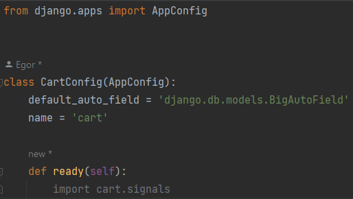

Теперь у вас настроено автоматическое создание корзины при создании пользователя.

## 1.3 Создание миграций, применение миграций (создание таблиц в БД), регистрация модели для отображения в админ панели

После описание модели необходимо создать питоновского посредника, который будет помогать трансформировать объекты базы данных в объекты python и наоборот

Для лучшей синхронизации дальнейшего заполнения БД (не нужно делать так каждый раз, только сейчас):
1. Остановите сервер.
2. Удалите базу данных `db.sqlite3` в корне проекта 

Затем в консоле (Terminal) пропишем команду (Важно! Это команда пишется каждый раз как вы делаете любые изменения в структуре модели)

`python manage.py makemigrations`

Далее скорее всего появится ошибка, что не установлена библиотека pillow для работы с картинками, это будет необходимо, 
так как мы используем поле ImageField, без него и библиотека не нужна.

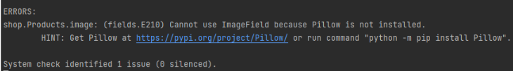

`pip install pillow`

Снова повторим `python manage.py makemigrations`

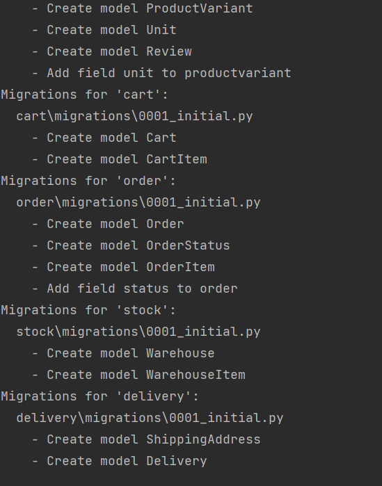

После успешного создания миграционного файла, его можно посмотреть в приложении в папке `migrations`. Так как мы создали
модели в приложении `store`, то в нём и посмотрите, что создалось в папке `migrations`

Затем добавим все эти модели в БД в виде таблиц.

`python manage.py migrate`

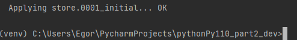

### Создание администратора

Создаём администратора по известной команде (создайте администратора с username `admin`)

Можно чуть упростить задачу с передать параметры в консоль, останется только 
вбить пароль и подтвердить его

`python manage.py createsuperuser --username=admin --email=admin@example.com`

### Проверка создания администратора

В терминале выполните следующую команду

`python manage.py shell`

В интерактивной оболочке Django которая откроется, выполните следующие команды:

```python
from django.contrib.auth.models import User
try:
    admin_user = User.objects.get(username='admin')
    print(admin_user)
except User.DoesNotExist:
    print("Пользователь не найден.")
```

Если администратор распечатался, значит он успешно создан. 

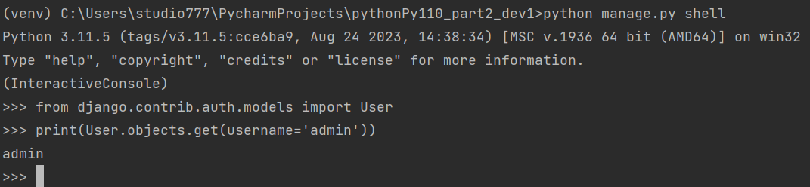

Для выхода из интерактивной оболочки напишите и выполните команду 

```python
exit()
```

### Регистрирование моделей в админ панели

Запустите сервер.

Если зайти в панель администратора, то можно не увидеть вновь созданных таблиц, так как мы не зарегистрировали 
эти модели для отображения в админ панели.

Для этого в файле `admin.py` своего приложения `store` пропишите

```python
from django.contrib import admin
from django.apps import apps
from .models import Product, ProductVariant, Unit, Currency, Category, Review

app = apps.get_app_config('store')
app.verbose_name = 'Магазин'  # verbose_name - заменит отображаемое название приложения в админ панели 

admin.site.register(Product)
admin.site.register(ProductVariant)
admin.site.register(Unit)
admin.site.register(Currency)
admin.site.register(Category)
admin.site.register(Review)
```

Теперь в админ панели появятся соответствующие таблицы (на русском языке), по умолчанию всё на английском

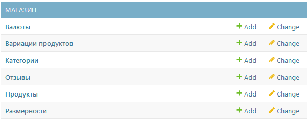

### Самостоятельно

Зарегистрируйте модели в остальных приложениях (`cart`, `order`, `delivery`, `stock`, `promotion`) 
в соответствующих `admin.py` своих приложений.


# 2. Заполнение данных в БД

Заполнение БД можно произвести 2-умя способами.

## 2.1 Ручное заполнение через панель администратора

Ручное заполнение самое простое, но самое долгое.

Далее работаем с приложением "МАГАЗИН" в админ панели.

Вручную добавьте категорию `"Овощи"` в таблицу "Категории" через админ панель.

Для этого зайдите в админ панель и рядом с "Категории" нажмите на `+Add`, 
затем в поле `Название` пропишите "Овощи". В графу `'slug' название` добавьте `vegetables`. 
Поле `Родительская категория` оставьте пустым, так как Овощи не являются подкатегорией

Нажмите "SAVE".

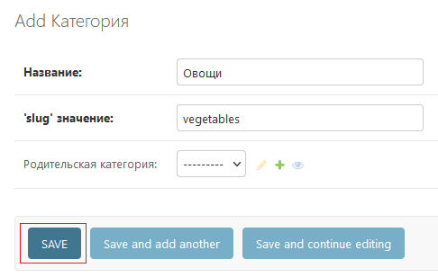

Далее создадим объект таблицы `Размерности`

| Поле        | Значение  |
|-------------|-----------|
| Название    | кг        |
| Описание    | Килограмм |
| Коэффициент | 1.0       |

Затем таблица `Валюты`

| Поле              | Значение |
|-------------------|----------|
| Название          | руб      |
| Описание          | Рубль    |
| Отображение знака | ₽        |


Далее создадим продукт `"Болгарский перец"`, для этого у `Продукты` нажимаем на `+Add` и
заполняем соответствующие поля

| Поле              | Значение                                                |
|-------------------|---------------------------------------------------------|
| Название          | Болгарский перец                                        |
| 'slug' значение   | bell_pepper                                             |
| Описание          | Сочный и яркий, он добавит красок и вкуса в ваши блюда. |
| Размерность       | кг                                                      |
| Количество за ед. | 1.0                                                     |
| Цена              | 300                                                     |
| Валюта            | руб                                                     |
| Категория         | Овощи                                                   |

В поле Image выбрать картинку товара болгарский перец из папки
`store/static/store/images/product-1.jpg`

Данный подход c `Цена`, `Количество за ед.`, `Размерность` читается как `Болгарский перец стоит 300 руб, за один мерную величину в 1 кг`.
Соответственно продаётся в объёме 1 кг. Так как во всех интернет магазинах с мерными товарами
определенная сложность и указывают стоимость за мерную величину и уже по факту пересчитывают.

Если планируется продавать целым мешком, допустим в 50 кг, по оптовой цене, то можно как вариацию указать
`Количество за ед.` = 50.0

Единственная сложность в таком подходе будет считать сколько рассыпного товара на складе, если они отличаются только тарой,
а на деле товар хранится врассыпную на складе в одном месте. Но это не наше дело об 
этом задумываться, так как это бизнес-логика логистики и хранения, что не является темой данного занятия.


Cоздадим дополнительные данные о продукте. Для этого создадим объект
`Подробности о продуктах`

| Поле                  | Значение         |
|-----------------------|------------------|
| Продукт               | Болгарский перец |
| Средний рейтинг       | 4.90             |
| Число отзывов         | 250              |
| Количество продаж     | 600              |
| Количество на складе  | 500              |
| Доступность к покупке | True             |


Также в таблице `Скидки на продукты` 
создайте скидку

| Поле                                   | Значение         |
|----------------------------------------|------------------|
| Продукт                                | Болгарский перец |
| Значение скидки                        | 30               |
| Процентная скидка                      | True             |
| Дата и время начала действия скидки    | Выберите любое   |
| Дата и время окончания действия скидки | Выберите любое   |
| Скидка активна                         | True             |

При заполнении объектов DatetimeField нужно учитывать, что Django по умолчанию
работает с UTC, а значит работает с 0-ым часовым поясом. Поэтому для МСК нужно 
ставить на 3 часа меньше(для МСК), чем есть на самом деле или планируется, так как МСК в
часовом поясе +3. Админ панель подскажет разницу в часовых поясах.

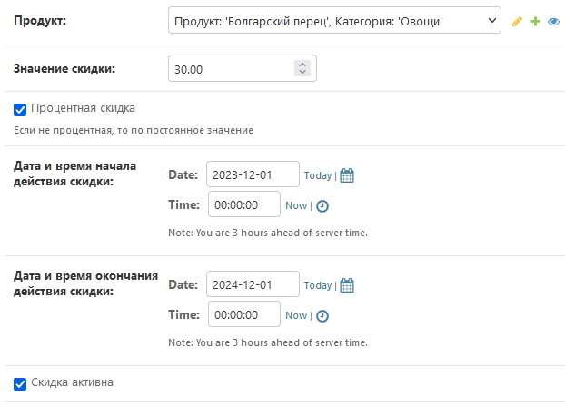

## 2.2 Заполнение через python script

Данный подход уже позволяет автоматизировать заполнение таблиц начальными данными. 
Допустим если нужно протестировать таблицу, но нужны какие-то данные для теста. 
В нашем случае мы будем использовать данный подход для заполнения таблицы данными. 
Так ещё будет проще восстановить, если сломается БД, а она была не в системе контроля версий.

На практике создают миграционный слой, по которому или переносят или восстанавливают данные.

Перенесите `clear_database.py` и `filling_database.py` файла из `files/lab2` 
в корень вашего проекта (там, где `manage.py`).

Для создания пользователей в `filling_database.py` необходима библиотеке Faker 
для создания несуществующих данных. Установите её

```
pip install faker
```

Остановите сервер(если он запущен) и запустите скрипт `clear_database.py` (
он удаляет БД и выполняет миграции), затем запустите `filling_database.py`, 
он заполнит базу данных данными, что делали вручную, только это сделает 
при помощи скрипта. 

В скрипте `filling_database.py` достаточно подробно написано, что и как сделано 
там ничего не нужно писать, просто ознакомиться. В скрипте 
реализовано несколько способов создания пользователей (цикл, асинхронная запись,
блоковая запись) приведены плюсы и минусы подходов, а также созданы объекты 
необходимых таблиц БД.

# 3. Перенос файлов из приложения store

Из приложения store перенесём все маршруты и обработчики по своим ответственным приложениям.

В из приложения `store` скопируйте `urls.py` и `views.py` в приложение `cart` с заменой файлов.
В `urls.py` приложения `cart` оставьте все пути, которые соответствуют корзине, 
в итоге должно получиться так

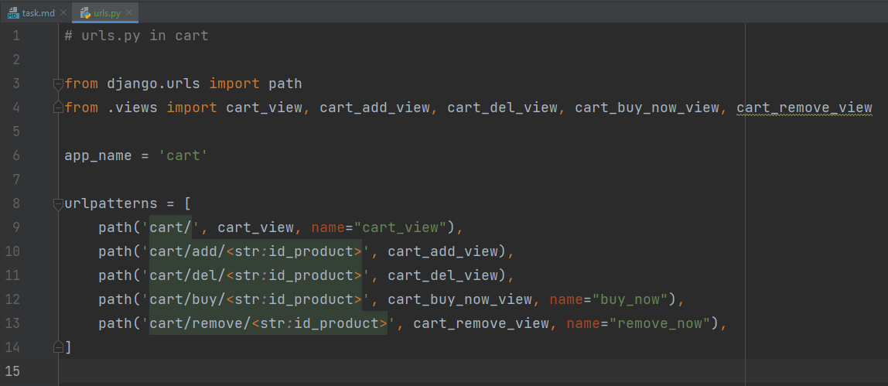

Значение `app_name='store'` замените на `app_name='cart'` 

Затем из всех путей в начале удалите `cart/`, 

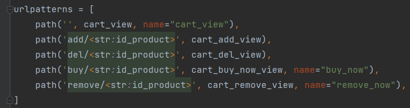

Расширим пути к приложению `cart` при помощи include в корневом `urls.py`

```python
urlpatterns = [
   ...,
    path('cart/', include('cart.urls')),
]
```

Далее разберемся с отображениями `views.py` приложения store. Так как ранее мы 
скопировали данные из store, то оставим только те данные, которые относятся к корзине 
(все где в названии есть cart) `cart_view`, `cart_add_view`, `cart_del_view`, 
`cart_buy_now_view`, `cart_remove_view`.

Единственное, что нужно будет словарь DATABASE импортировать не из `.models` 
(так как там его нет теперь), а из `store.models`

```python
from store.models import DATABASE
```

Последнее, что осталось восстановить, это все ссылки переходов, так как ранее app_name='store' было
заменено на app_name='cart', поэтому для всех функций отображений поменяем ссылки в html

в шаблоне `base.html` приложения `store` поменяйте `href=""` на
`href=""`

в шаблоне `shop.html` приложения `store` поменяйте `href=""` 
на `href=""`

в шаблоне `shop.html` приложения `store` поменяйте `href="""` 
на `href=""`

После этого, перенесите `cart.html` из `store/templates/store/` в  `cart/templates/cart/`

Во `views.py` приложения `cart` в `cart_view` в render вместо `"store/cart.html"` передайте
`"cart/cart.html"`, затем в `cart_buy_now_view` и `cart_remove_view` вместо `"store:cart_view"` 
пропишем `"cart:cart_view"`

Затем в приложении store удалим всё, что было ранее связано с корзиной. В `urls.py` и `views.py`

Теперь корзина должна вновь нормально функционировать.

Кажется всё, что делали выше не имеет смысла, в большей степени да. Но теперь были показаны,
что предстоит сделать в случае разделения одного приложения на несколько.

# 4. Создание запросов в БД

Перепишем функционал, что был ранее (получение данных с словаря DATABASE) 
на получение данных с базы данных.

## 4.1 Главная страница (shop.html)

Вo views.py приложения store замените shop_view на предложеный код

```python
from .models import Product
from django.db.models import F
from django.core.paginator import Paginator, EmptyPage, PageNotAnInteger


def shop_view(request):
    if request.method == "GET":
        products = Product.objects.all().annotate(
            price_before=F("price"),
            price_after=F("price_before")*(100-F("discount__value"))/100
        )
        # Обработка фильтрации из параметров запроса
        if category_key := request.GET.get("category"):  # Если существует category в адресной строке
            if ordering_key := request.GET.get("ordering"):   # Если существует ordering в адресной строке
                if request.GET.get("reverse") in ('true', 'True'):
                    data = products.filter(category__name=category_key).order_by(f"-{ordering_key}")
                else:
                    data = products.filter(category__name=category_key).order_by(ordering_key)
            else:
                data = products.filter(category__name=category_key)
        else:
            data = products

        # # Добавляем пагинацию
        # page = request.GET.get('page', 1)
        # paginator = Paginator(data, 5)  # Разбиваем на 5 элементов на странице
        # try:
        #     data = paginator.page(page)
        # except PageNotAnInteger:
        #     data = paginator.page(1)
        # except EmptyPage:
        #     data = paginator.page(paginator.num_pages)

        return render(request, 'store/shop.html',
                      context={"products": data,
                               "category": category_key})
```

Что происходит в данном коде:
```python
products = Product.objects.all().annotate(
            price_before=F("price"),
            price_after=F("price_before")*(100-F("discount__value"))/100
        )
```
Здесь создаётся запрос к таблице Product, затем при помощи annotate добавляются 
новые колонки в результат запроса(Объект F удобен чтобы обратиться к колонке): 
* поле `price_before`, которое берет свои значения из поля `price`
* поле `price_after`, которе вычисляется как цена до скидки умноженная на скидку(
обратите внимание, что у Product есть поля которые мы в моделях явно не создавали
discount, однако, в моделях `ProductDiscount` через 
параметр `related_name=variant` задавали эти поля. Обратите
внимание, что доступ к полям через отношение идёт через "__")

Далее при помощи объекта фильтрации products.filter фильтруем результаты 
по соответствующим условиям, допустим фильтрация по категории 
(если она была передана)

Последнее и оно закомментировано, это пагинация, при помощи неё можно 
получить часть данных, в данном случае по 5 товаров и уже вернуть эти результаты.
Если хотите рассмотреть пагинацию, то раскомменируйте код и посмотрите, что вернётся.

Теперь, чтобы всё корректно отображалось - необходимо немного поменять `shop.html`,
так как не все переменные остались с тем же названием.

`href=""` замените на 
`href=""`

`src="{{ product.url }}"` замените на `src="{{ product.image.url }}"`

`<span class="status">{{product.discount}}%</span>` замените на 
`<span class="status">{{product.discount.value}}%</span>`

Также в области цены со скидкой (price_after) добавьте `floatformat:2`, чтобы 
привести цену к float типу с точностью 2 (было получено опытным путем, так как 
после расчёта цены после скидки цена становится float, но без плавающей точности)

`{{ product.price_after|floatformat:2 }}`

точные местоположения замен приведены ниже на рисунке

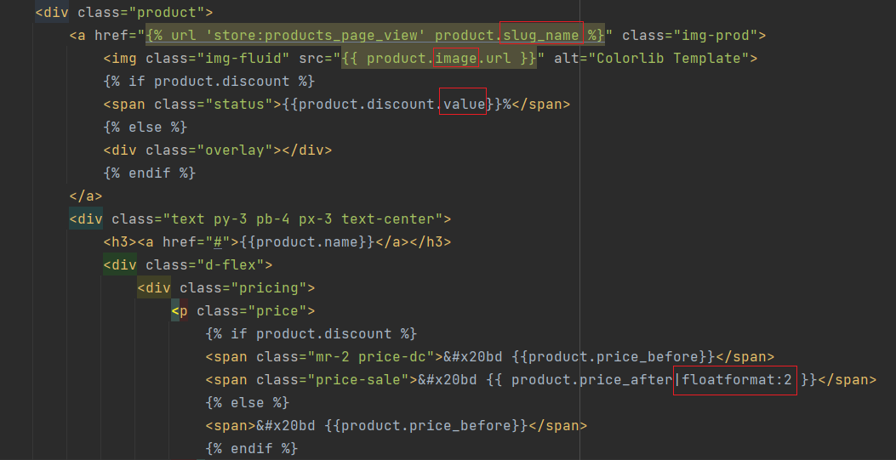


## 4.2 Страница с отдельными товарами (product.html)

Теперь возьмемся за страницу товара.

Во `views.py` приложения `store` существует 2 функции `products_page_view` 
закомментируйте или удалите нижнюю (она попала как возможный вариант), а уже с оставшейся
будем работать.

В придённом `products_page_view` рассматривается получение страницы о продукте 
по двум возможным путям когда page типа `slug` `path('product/<slug:page>.html',...,)` и 
когда page типа int `path('product/<int:page>', ...)`, поэтому создадим запросы для решения данных задач

Замените следующий код (аннотация бы применена для минимизации исправления html 
кода в `product.html`):

```python
def products_page_view(request, page):
    if request.method == "GET":
        if isinstance(page, str):
            # Получение продукта по полю slug_name.
            product = Product.objects.filter(slug_name=page)
            # Создание запроса с дополнительными полями
            # (поля сделаны так, чтобы минимизировать изменения в коде product.html)
            product = product.annotate(
                price_before=F("price"),
                price_after=F("price_before") * (
                            100 - F("discount__value")) / 100,
                review=F("details__review_count"),
                rating=F("details__rating_mean"),
                sold_value=F("details__sold_value"),
                weight_in_stock=F("details__quantity_in_stock"),
            )
            product = product.first()  # Получение первого элемента из QuerySet

            return render(request, "store/product.html",
                          context={"product": product})

        elif isinstance(page, int):
            # Обрабатываем условие того, что пытаемся получить страницу товара по его id
            data = DATABASE.get(str(page))  # Получаем какой странице соответствует данный id

            # Можно сделать и одни запросом при помощи метода get. Метод get возвращает только один объект, всегда.
            # get не возвращает QuerySet, поэтому после get нельзя делать аннотации, фильтры, и т.д.

            product = Product.objects.annotate(
                price_before=F("price"),
                price_after=F("price_before") * (
                        100 - F("discount__value")) / 100,
                review=F("details__review_count"),
                rating=F("details__rating_mean"),
                sold_value=F("details__sold_value"),
                weight_in_stock=F("details__quantity_in_stock"),
            ).get(id=page)

            return render(request, "store/product.html",
                          context={"product": product})

        return HttpResponse(status=404)
```

В product.html замените `` на `{{ product.image.url }}` 
всего должно быть две замены в файле. 

Теперь информация о продуктах должна отображаться корректно.

## 4.3 Корзина (cart.html)

Далее разберемся с корзиной и сделаем так, чтобы теперь данные записывались, 
считывались, изменялись без использования отдельного файла, так как есть таблицы в БД.

Во `views.py` приложения `cart` поправим `cart_view`:

```python
from .models import Cart, CartItem
from store.models import Product
from django.db.models import ExpressionWrapper, F, DecimalField, Case, When, Value


def cart_view(request):
    if request.method == "GET":
        cart = Cart.objects.get(customer=request.user)

        # При помощи select_related подгружаем дополнительные таблицы в одном запросе,
        # чтобы уменьшить число запросов
        products = cart.items.select_related(
            'product',
            'product__discount',
            'product__image').all()  # Список продуктов
        # Проводим аннотацию, чтобы собрать нужные значения в products
        products = products.annotate(
            price_after=Case(
                When(product__discount__isnull=False,
                     then=ExpressionWrapper(
                         F("product__price") * (100 - F(
                             "product__discount__value")) / 100,
                         output_field=DecimalField()
                     )),
                default=F("product__price"),  # Если скидки нет, использовать обычную цену
            ),  # Case - оператор выбора при условии When, если нет подходящих условий,
            # то возвращается default
            price_total=ExpressionWrapper(
                F("quantity") * F("price_after"),
                output_field=DecimalField()),
            name=F("product__name"),
            description=F("product__description"),
            url=F("product__image"),
        ).values("id", "quantity", "price_after", "price_total", "name", "description", "url")
        # values аналогично SELECT позволяет в запросе указать на вывод только те колонки, что необходимы
        return render(request, "cart/cart.html", context={"products": products})
```

в `cart.html` замените `` на `/{{ product.url }}`, ранее
не добавляли дополнительно `/` к url картинки. Теперь это было сделано, так как
когда использовали values, то возвращается значение, а не объект.

Теперь корзина отображает данные полученные с таблицы Cart.

Переделаем добавление и удаление в корзину.

```python
@login_required(login_url='login:login_view')
def cart_buy_now_view(request, id_product):
    if request.method == "GET":
        cart = Cart.objects.get(customer=request.user)  # Получили корзину по пользователю
        product = Product.objects.get(id=id_product)  # Получили продукт по его id
        if product:
            CartItem.objects.create(cart=cart, product=product)  # Создали объект в CartItem по данным
            return redirect("cart:cart_view")

        return HttpResponseNotFound("Неудачное добавление в корзину")


def cart_remove_view(request, id_product):
    # id_product - неудачное название, так как на самом деле передаётся id_cart_item
    # тоесть номер строки в базе данных CartItem, поэтому при удалении получаем объект по его id и удаляем
    if request.method == "GET":
        cart_item = CartItem.objects.get(id=id_product)  # получаем объект по его id 
        if cart_item:
            cart_item.delete()  # удаляем объект из БД
            return redirect("cart:cart_view")
        return HttpResponseNotFound("Неудачное удаление из корзины")


@login_required(login_url='login:login_view')
def cart_add_view(request, id_product):
    # Реализация для добавления в корзину, при нажатии на + на главной странице
    # (когда возвращается JSON, а не html)
    if request.method == "GET":
        cart = Cart.objects.get(customer=request.user)
        product = Product.objects.get(id=id_product)
        if product:
            CartItem.objects.create(cart=cart, product=product)
            return JsonResponse(
                {"answer": "Продукт успешно добавлен в корзину"},
                json_dumps_params={'ensure_ascii': False})

        return JsonResponse({"answer": "Неудачное добавление в корзину"},
                            status=404,
                            json_dumps_params={'ensure_ascii': False})


def cart_del_view(request, id_product):
    # Реализация для удаления из корзины с возвращением JSON, а не html
    if request.method == "GET":
        cart_item = CartItem.objects.get(id=id_product)
        if cart_item:
            cart_item.delete()
            return JsonResponse({"answer": "Продукт успешно удалён из корзины"},
                                json_dumps_params={'ensure_ascii': False})

        return JsonResponse({"answer": "Неудачное удаление из корзины"},
                            status=404,
                            json_dumps_params={'ensure_ascii': False})
```

Теперь работа с корзиной полностью перенесена в БД.

# 5.Отображение запросов в БД.

Последнее, что осталось, это как-то мониторить то, что делаете в БД, для этого 
воспользуемся библиотекой `django debug toolbar` 

https://django-debug-toolbar.readthedocs.io/en/latest/installation.html

```
pip install django-debug-toolbar
```

Затем в settings.py необходимо прописать

в INSTALLED_APPS

```python
INSTALLED_APPS = [
    # ...
    "debug_toolbar",
    # ...
]
```

в MIDDLEWARE в конец списка добавьте

```python
MIDDLEWARE = [
    # ...
    "debug_toolbar.middleware.DebugToolbarMiddleware",
]
```
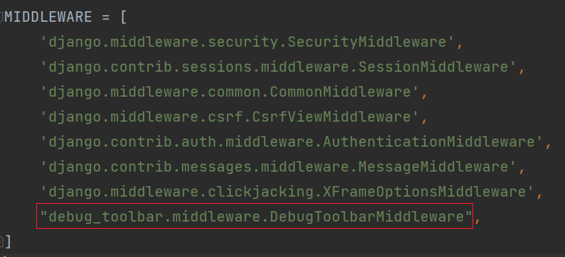

В конце settings.py добавьте

```python
INTERNAL_IPS = [
    "127.0.0.1",
]
```


В корневой `urls.py` необходимо добавить

```python
from project.settings import DEBUG

if DEBUG:
    urlpatterns += [
        path("__debug__/", include("debug_toolbar.urls")),
    ]
```

`If DEBUG:` означает, что данный код выполнится только в режиме дебага, 
а именно произойдет расширение маршрутов

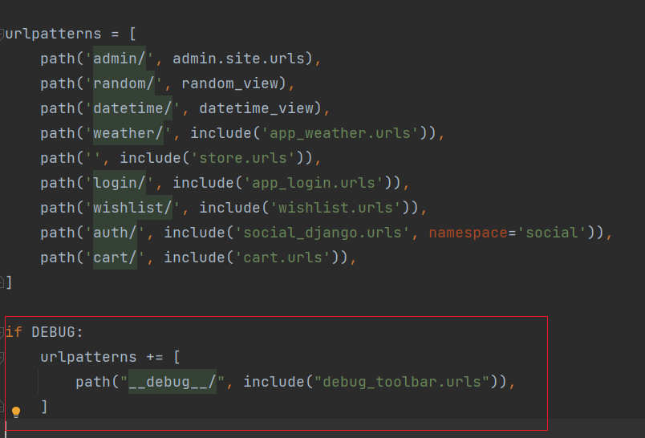

Теперь если зайти на любую страницу, то появится дополнительное окно, где можно 
получить дополнительную информацию, допустим такую как время выполнения SQL запроса 
и что конкретно выполнялось

Пример для главной страницы

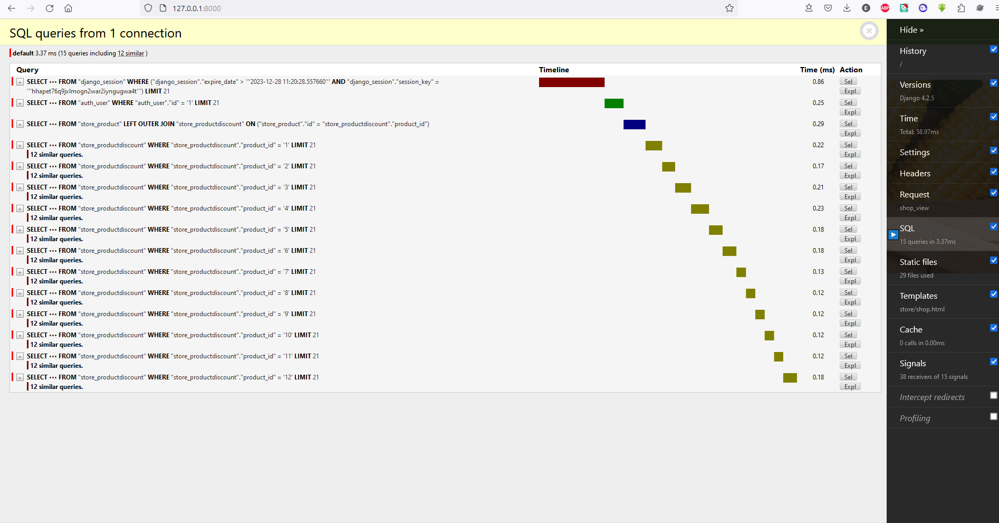

## Отображение запросов в консоле

Есть возможность отображение дополнительный информации в консоле при работе с ORM

Для этого вызовите 

```python manage.py debugsqlshell```

Появится интерактивная консоль с возможность создания и отображения запросов через ORM

Выполните следующий запрос в этой консоле
```python
from store.models import Product
Product.objects.all()
```
Появится полный запрос в БД и время его выполнения. Рассмотрите как выполняются следующие запросы.

Выполните следующие запросы:

```python
Product.objects.filter(name="Болгарский перец")
```

```python
Product.objects.filter(name="Болгарский перец").values("id", "name", "price")
```

```python
from django.db.models import F 
Product.objects.filter(name="Болгарский перец").annotate(discount_value=F("discount__value")).values("id", "name", "price", "discount_value")
```

# Практика закончена

# Дополнительное (необязательное) задание

Ранее вы делали(кто делал) избранное на данном интернет магазине. Перекопируйте код ранее, 
и постарайтесь перенести избранное в БД, для этого нужно подумать какие модели в БД добавить и 
как к ним обратиться чтобы решить те задачи, что реализовали ранее.