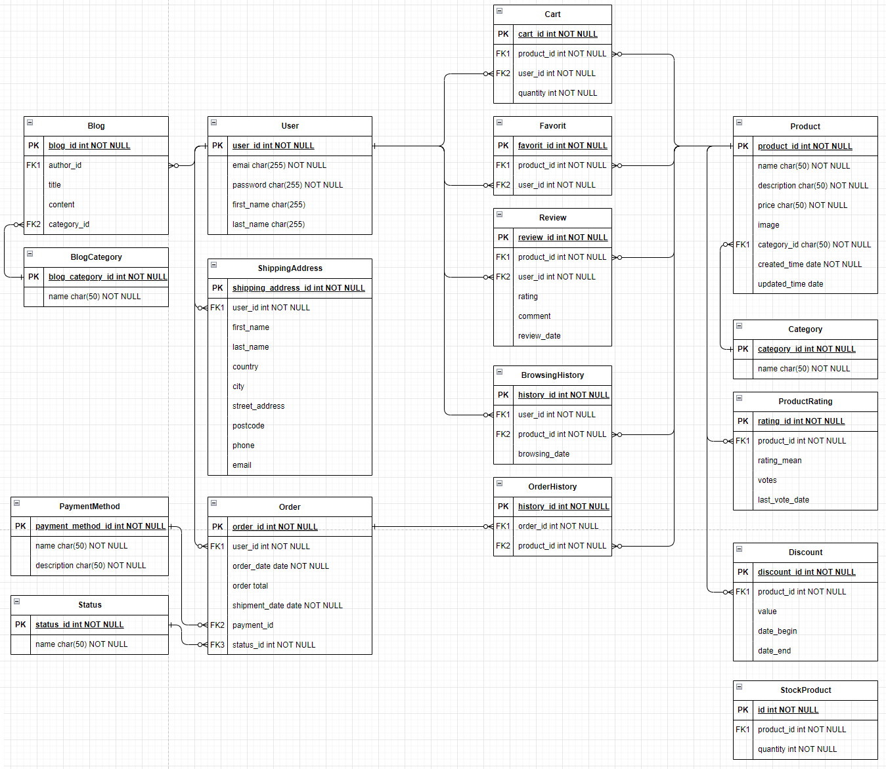
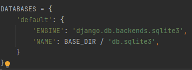
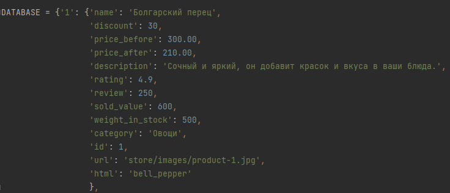

# Общие вопросы по проектировании БД (Чтение)

## Проектирование

Проектирование базы данных (БД) является важным этапом в создании информационных систем, и правильное проектирование влияет на эффективность, надежность и поддерживаемость вашей системы. Вот несколько ключевых шагов и принципов, которые помогут вам правильно спроектировать базу данных:

1. Определение требований:

> Четко определите цели вашей системы и требования к данным.
> Идентифицируйте основные сущности (таблицы), атрибуты (поля) и их взаимосвязи.

2. Нормализация данных:
> Применяйте нормализацию для избегания избыточности данных и поддержания целостности.
> Разделяйте данные на связанные таблицы, чтобы избежать дублирования информации.

3. Определение сущностей и связей:

> Идентифицируйте основные сущности и их атрибуты.
> Определите отношения между сущностями, используя первичные и внешние ключи.

4. Использование правильных типов данных:

> Выбирайте подходящие типы данных для каждого поля (целочисленные, строковые, десятичные и т. д.).
> Используйте ограничения, такие как NOT NULL и UNIQUE, для обеспечения целостности данных.

5. Установление связей:

> Используйте внешние ключи для установления связей между таблицами.
> Разработайте связи так, чтобы поддерживать целостность данных и оптимизировать производительность.

## Выделение сущностей

Определение, когда выделять отдельную сущность в отдельную таблицу, а когда это необходимо делать, зависит от конкретных требований вашего приложения и концепции проектирования базы данных. 
Однако, есть несколько общих правил и рекомендаций:

### Когда выделять в отдельную таблицу:

1. `Нормализация`:

Если у вас есть множество повторяющихся данных, и вы хотите избежать их дублирования, следуйте принципам нормализации. Выделяйте такие данные в отдельные таблицы.

2. `Разделение ответственности`:

Если у вас есть логически отдельные сущности, каждая из которых имеет свою ответственность, выделяйте их в отдельные таблицы. Это упрощает понимание и обслуживание кода.

3. `Избегание избыточности`:

Если данные характерны только для подмножества записей в основной таблице, выделяйте их в отдельную таблицу, чтобы избежать избыточности данных.

4. `Оптимизация производительности`:

Выделяйте данные в отдельные таблицы, чтобы улучшить производительность запросов, особенно если данные часто используются в различных контекстах.

5. `Улучшение структуры данных`:

Выделяйте связанные данные в отдельные таблицы для улучшения структуры и читаемости вашей базы данных.

### Когда не выделять в отдельную таблицу:

1. `Простые случаи`:

Если ваша структура данных относительно проста и вы не сталкиваетесь с повторяющейся информацией, можете оставить данные в одной таблице.

2. `Денормализация для производительности`:

В некоторых случаях, для улучшения производительности, может потребоваться денормализовать данные и хранить их в одной таблице.

3. `Однозначность`:

Если связь между сущностями однозначна, и нет необходимости в сложных отношениях, вы можете оставить данные в одной таблице.

4. `Меньше поддержки`:

В некоторых случаях, если сущность используется редко и не требует сложных операций, ее можно оставить в одной таблице для упрощения работы с данными.

### Ключевые вопросы для принятия решения:

1. `Частота использования`:

Как часто данные будут использоваться в запросах? Если часто, то выделение в отдельную таблицу может улучшить производительность.

2. `Связи и зависимости`:

Какие связи существуют между данными? Если сущности тесно связаны, и выделять их в отдельные таблицы усложнит запросы, может быть лучше оставить их в одной таблице.

3. `Повторяемость данных`:

Есть ли повторяющиеся данные, которые можно избежать выделением в отдельную таблицу?

4. `Сложность бизнес-логики`:

Как сложна бизнес-логика, требуемая для обработки этих данных? Выделение в отдельную таблицу может сделать код более понятным и управляемым.

5. `Будущие изменения`:

Какие изменения в данных и требованиях могут возникнуть в будущем? Предположения о будущих изменениях могут влиять на ваше решение.

## Примеры проектирования

Рассмотрим примеры хорошо и плохо спроектированных баз данных.

В примерах я буду использовать простую модель для интернет-магазина, где есть продукты, категории продуктов и заказы.

### Пример хорошо спроектированной базы данных:

`Таблица "Product"`:

* `product_id` (PrimaryKey): Уникальный идентификатор продукта.
* `name`: Название продукта.
* `price`: Цена продукта.
* `category_id` (ForeignKey): Ссылка на категорию продукта.

`Таблица "Category"`:

* `category_id` (PrimaryKey): Уникальный идентификатор категории.
* `name`: Название категории.

`Таблица "Order"`:

* `order_id` (PrimaryKey): Уникальный идентификатор заказа.
* `customer_id` (ForeignKey): Ссылка на покупателя.
* `order_date`: Дата оформления заказа.

`Таблица "OrderItem"`:

* `order_item_id` (PrimaryKey): Уникальный идентификатор записи о продукте в заказе.
* `order_id` (ForeignKey): Ссылка на заказ.
* `product_id` (ForeignKey): Ссылка на продукт.
* `quantity`: Количество заказанных продуктов.

Преимущества:

* Использование первичных и внешних ключей для установления связей.
* Нормализация данных для избежания избыточности.
* Четкая структура таблиц, соответствующая бизнес-логике.

### Пример плохо спроектированной базы данных:

`Таблица "Products"`:
* `id` (PrimaryKey): Уникальный идентификатор продукта.
* `product_name`: Название продукта.
* `product_price`: Цена продукта.
* `category`: Категория продукта в виде текстовой строки.

`Таблица "Orders"`:
* `order_id` (PrimaryKey): Уникальный идентификатор заказа.
* `customer`: Имя покупателя.
* `order_date`: Дата оформления заказа.

`Таблица "OrderDetails"`:
* `detail_id` (PrimaryKey): Уникальный идентификатор записи о продукте в заказе.
* `order_id`: Ссылка на заказ.
* `product_id`: Ссылка на продукт.
* `product_name`: Название продукта (дублируется из таблицы "Products").
* `quantity`: Количество заказанных продуктов.
* `total_price`: Общая цена продукта в заказе (дублируется из таблицы "Products").

Недостатки:

* Использование текстовых строк вместо идентификаторов для категорий и продуктов.
* Дублирование данных (например, название продукта и цена в таблице "OrderDetails").
* Отсутствие явных связей между таблицами.
* Непоследовательные имена столбцов и таблиц.

### Рекомендации:

1. Используйте первичные и внешние ключи:

> Хорошо спроектированные базы данных используют ключи для установления связей между таблицами.

2. Нормализуйте данные:

> Избегайте избыточности данных и следуйте принципам нормализации.

3. Избегайте дублирования:

> Не дублируйте данные без необходимости, используйте ссылки на их первичные ключи.

4. Соблюдайте стандарты именования:

> Имена столбцов и таблиц должны быть осмысленными и соблюдать стандарты именования.

5. Ясные связи между таблицами:

> Используйте внешние ключи и явные связи для лучшей читаемости и поддержки кода.

6. Поддерживайте целостность данных:

> Обеспечивайте целостность данных с использованием ограничений (например, NOT NULL, UNIQUE).

7. Используйте идентификаторы вместо текстовых строк:

> Для категорий, продуктов и других связанных данных предпочтительнее использовать идентификаторы вместо текстовых строк.

### Пример сущностей БД для рассматриваемоего интернет -магазина
В общем виде, до определенной точности и для рассматриваемого интернет-магазина, сущности в БД можно описать следующими объектами и взаимосвязями

Наша БД реализована частично и немного с другими полями

# 1. Создание моделей (большой блок для чтения. Практические действия начинаются с параграфа 1.3 в task.md)

Ранее мы использовали словарь `DATABASE` в `store/models.py`, теперь воспользуемся моделями в Django и создадим таблицу в БД Django

По умолчанию Django создаёт БД SQLite, которую можно переименовать в `settings.py` или выбрать подключение к другой базе данных.

Модели создаются в файле `models.py` своего приложения.

Создадим модель описывающую товар. Для этого определимся какие характеристики товара нам необходимо хранить в таблице базы
данных товара.

Ранее в `DATABASE` была записана следующая информация необходимая для корректного отображения информации на сайте:

Разделим эти данные на отдельные сущности связанные друг с другом отношениями. При разделении будем придерживаться подхода, что если
сущность будет простой и данные этой сущности не будут дублироваться в других таблицах, то новая таблица под 
эту сущность создаваться не будет

Ниже будем использовать следующие обозначения:
* `PrimaryKey` - Первичный ключ. Идентификационный ключ объекта сущности.

* `ForeignKey` - Отношение Один ко Многим. Это отношение, при котором один объект в одной таблице связан с несколькими объектами в другой таблице. 
Например, у каждого автора может быть несколько книг, но каждая книга принадлежит только одному автору. 

* `ManyToMany` - Отношение Много ко Многим. Это отношение, при котором каждый объект в одной таблице может быть связан с несколькими объектами в другой таблице, и наоборот. 
Например, каждый студент может выбирать несколько курсов, и каждый курс может иметь несколько студентов.

* `OneToOne` - Отношение Один к Одному. Это отношение, при котором каждый объект в одной таблице может быть связан с одним объектом в другой таблице. 
Применяется для расширения первичной таблицы без изменения первичной таблицы, а также для настройки прав доступа. 
Например, у сотрудника есть поле паспорт, можно эти личные данные описать в общей таблице с данными сотрудника,
тогда любой кто имеет доступ к общей таблице может увидеть личные данные любого сотрудника. Или можно создать отдельную
таблицу и связать её отношением Один к одному и поставить определенные права на чтение данной таблицы, тогда 
даже если у злоумышленника есть доступ к общим данным, то без специального уровня доступа он не сможет узнать личные данные сотрудника.

## 1.1 Упрощенное техническое задание на создаваемую БД
Ниже приведены обобщенные требования к разработке сервиса (интернет-магазин) 
из которого будут браться данные о необходимых таблицах и зависимостях. Не стоит задача реализовать всё. 
Требования приведены в качества примера требования к функциональности сервиса.

Эти требования предоставляют базовый функционал интернет-магазина. 
В реальных проектах могут быть добавлены дополнительные функции в зависимости от потребностей бизнеса. Допустим как
где должен работать сервис, его архитектура, нагрузочные характеристики (какую нагрузку должен стабильно без сбоев держать сервис) и т.д.

### Требования к функционалу интернет-магазина:

1. Каталог товаров:

> * Пользователь должен иметь возможность просматривать каталог товаров.
> * Товары должны быть разделены по категориям.
> * Каждый товар должен содержать название, описание, средний рейтинг, количество отзывов, объем продаж, категорию, изображение.

2. Фильтрация и поиск:

> * Предоставить возможность фильтрации товаров по категориям.
> * Реализовать поиск товаров по названию и описанию.

3. Вариации товаров:

> * Товары могут иметь различные вариации (размеры, вес, единицы измерения).
> * Для каждой вариации товара должны быть указаны цена, количество на складе, статус доступности.

4. Промокции и скидки:

> * Реализовать систему промокодов с разными видами акций (скидка на продукт, общая скидка на заказ, бесплатная доставка, акция "Купи N, получи M бесплатно").
> * Промокции должны иметь уникальные коды, описание, дату начала и окончания, статус активности.

5. Отзывы и рейтинг:

> * Пользователи могут оставлять отзывы на продукты.
> * Отзывы содержат рейтинг, комментарий, дату создания.

6. Корзина и оформление заказа:

> * Пользователи могут добавлять товары в корзину.
> * В корзине отображается общая стоимость товаров и возможность просмотра и редактирования содержимого.
> * Реализовать оформление заказа с указанием адреса доставки и выбора способа доставки.

7. Заказ и доставка:

> * Пользователи могут просматривать историю своих заказов.
> * Заказы должны содержать информацию о статусе, общей стоимости, выбранной доставке и позициях в заказе.
> * Реализовать систему отслеживания статуса доставки с указанием трекинг-номера и предполагаемой датой доставки.

8. Склад:

> * Вести учет товаров на складе с указанием количества для каждой вариации товара.
> * Обеспечить возможность управления запасами на складе.

9. Административный функционал:

> * Администратор должен иметь доступ к управлению товарами, категориями, промокциями, заказами, отзывами и другими сущностями.
> * Реализовать интерфейс администратора для удобного управления данными.

10. Безопасность и аутентификация:

> * Реализовать систему аутентификации и авторизации пользователей.
> * Обеспечить безопасность пользовательских данных и транзакций.

11. Мобильная адаптация:

> * Сайт должен быть адаптирован для просмотра на мобильных устройствах.

12. Статистика и аналитика:

> * Вести статистику продаж, отзывов, активности пользователей.
> * Обеспечить аналитику для принятия решений по улучшению сервиса.

13. Многопользовательский режим:

> * Реализовать возможность регистрации и аутентификации пользователей.
> * Обеспечить многопользовательский режим с учетными записями и персональными данными.

14. Поддержка различных единиц измерения:

> * Поддержка различных единиц измерения для товаров с возможностью конвертации.

15. Работа с картинками:

> * Предоставить возможность загрузки и отображения изображений для товаров.

16. Многоязычность:

> * Реализовать поддержку многоязычности для интерфейса сайта.

17. Гибкость системы:

> * Система должна быть гибкой и легко расширяемой для добавления новых функциональных возможностей.

18. Документация:

> * Подготовить документацию по использованию и администрированию системы.

## 1.2 Описание моделей

В данной БД не будем создавать отдельной таблицы для покупателей, а воспользуемся
стандартной моделью User

По приведенным данным из технического задания, таблицы можно разбить на следующие 
сущности со своими характеристиками:

### 1.2.1 Продукт

Модель `Продукт (Product)`:
* `product_id` (PrimaryKey): Уникальный идентификационный номер продукта
* `name` (CharField): Название товара
* `discount` (DecimalField): Скидка
* `price_original` (DecimalField): Цена без учета скидки
* `price_discouned` (DecimalField): Цена с учетом скидки
* `description` (TextField): Описание
* `rating_mean` (DecimalField): Средний рейтинг
* `review_count` (PositiveIntegerField): Число отзывов
* `sold_value` (PositiveIntegerField): Число проданных единиц(позиций) товара.
* `quantity_in_stock` (DecimalField): Объём товара на складе (кг, л, шт)
* `category` (ForeignKey): Ссылка на категорию
* `image` (ImageField): Картинка товара
* `slug_name` (SlugField): Имя html формы
* `created_at` (DateTimeField): Время создания объекта сущности в базе данных
* `updated_at` (DateTimeField): Время обновления объекта сущности в базе данных

Подход с хранением значения `price_discouned` в БД удобен в том случае, если это значение изменяется относительно не часто.

Можно также и вычислять его после запроса в БД. Такой подход будет более гибко адаптироваться под изменение цены, но при этом требовать
больше вычислительных мощностей для вычисления цены товара после скидки. Однако, данный момент можно чуть оптимизировать за счёт применения
кеширования.

Поэтому для текущего варианта возьмём сущность без атрибута `price_discouned` и `discount`, а будем вычислять его динамически.

Тогда сущность Продукт будет следующей:

Модель `Продукт (Product)`:
* `product_id` (PrimaryKey): Уникальный идентификационный номер продукта
* `name` (CharField): Название товара
* `price` (DecimalField): Регулярная цена (без учета скидки)
* `description` (TextField): Описание
* `rating_mean` (DecimalField): Средний рейтинг
* `review_count` (PositiveIntegerField): Число отзывов
* `sold_value` (PositiveIntegerField): Число проданных единиц(позиций) товара.
* `quantity_in_stock` (DecimalField): Объём товара на складе (кг, л, шт)
* `category` (ForeignKey): Ссылка на категорию
* `image` (ImageField): Картинка товара
* `slug_name` (SlugField): Имя html формы
* `created_at` (DateTimeField): Время создания объекта сущности в базе данных
* `updated_at` (DateTimeField): Время обновления объекта сущности в базе данных

#### Добавление данных о количественных характеристиках товара

Так как в интернет магазине могут существовать товары с совершенно разными параметрами измерения,
какой-то товар измеряется в кг, какой-то в штуках, какой-то в литрах, то создадим
отдельные таблицы для этого.

`Unit` - Таблица для хранения единиц измерения, таких как кг, л или штуки.

Модель `Единица измерения (Unit)`:
* `unit_id` (PrimaryKey): Уникальный идентификационный номер единицы измерения продукта
* `name` (CharField): Название единицы измерения
* `description` (TextField): Описание единицы измерения
* `conversion_factor` (FloatField): Коэффициент для перевода (допустим из грамм в килограммы и т.д.)

#### Разделение на Product и ProductVariant

Так как один и тот же товар может продаваться в разных упаковках, 
то классический подход(не для товара, а вообще в принципе, для похожего типа задач) 
будет разделения товара на 2 сущности: `Product` и `ProductVariant`, где

`Product` - Таблица Продукт с основными данными продукта, а `ProductVariant` - это
вариация этого самого продукта(упаковка 1 кг и 2 кг, это вариация одного и того 
же продукта)

`Product` - Таблица Продукт с основными данными продукта, которые не будут 
зависеть от характеристик упаковки товара. Допустим название товара что в таре 1кг,
что в 2 кг, будут одинаковые. Описание, категория будет одинаковая. Остальное уже
зависит от логики функционирования сайта. 
> Допустим на все вариации товара может 
быть одна картинка, тогда логично, что ссылка на картинку будет в `Product`, но 
если подразумевается, что будут разные картинки на вариации, то ссылку на картинку можно 
реализовать в `ProductVariant` (часто такое можно наблюдать на маркетплейсах или 
допустим на цветочном сервисе, когда в обзоре есть определенный букет, 
а при более детальной информации можно выбрать размер букета и картинка букета изменяется)

> Также можно рассмотреть функциональность когда в зависимости от вариации 
продукта можно отслеживать такие характеристики как рейтинг, 
число проданных единиц, отзывы для конкретной вариации, но это уже зависит 
от требований для анализа собираемой информации. 

Тогда из всего выше сказанного Продукт будет следующим:

Модель `Product (Продукт)`:
* `product_id` (PrimaryKey): Уникальный идентификационный номер продукта
* `name` (CharField): Название товара
* `description` (TextField): Описание
* `rating_mean` (DecimalField): Средний рейтинг на продукт (вне зависимости от вариации)
* `review_count` (PositiveIntegerField): Число отзывов (вне зависимости от вариации)
* `sold_value` (PositiveIntegerField): Объём проданного товара
* `category` (ForeignKey): Ссылка на категорию
* `image` (ImageField): Картинка товара (вне зависимости от вариации)
* `created_at` (DateTimeField): Время создания объекта сущности в базе данных
* `updated_at` (DateTimeField): Время обновления объекта сущности в базе данных

А Вариация Продукта будет следующим:

Модель `ProductVariant (Вариация продукта)`:
* `product_item_id` (PrimaryKey): Ссылка на продукт
* `product` (ForeignKey): Ссылка на продукт
* `unit`(ForeignKey): Ссылка на единицу измерения
* `quantity_per_unit` (DecimalField): Значение у размерности
* `price` (DecimalField): Регулярная цена (без учета скидки)
* `currency` (ForeignKey): Ссылка на валюту цены
* `quantity_in_stock` (PositiveIntegerField): Объём товара на складе (на вариацию товара)
* `is_available` (BooleanField): Доступность данного варианта продукта к продаже
* `created_at` (DateTimeField): Время создания объекта сущности в базе данных
* `updated_at` (DateTimeField): Время обновления объекта сущности в базе данных

Данные структуры таблиц базы приведены как тренировочные, в реальности всё зависит 
от требований к собираемым данным и быстродействии получаемых запросов. 
Повторение данных `rating_mean`, `review_count`, `sold_value` в `Product` и `ProductItem` 
было сделано для упрощения возможной аналитики (определения какая вариация товара популярнее и т.д.),
так как чаще всего если эти аналитические данные редко используются на сайте, то их
получают из агрегации запросов по таблице Заказ(Order). 

### 1.2.2 Размерность

Модель `Размерность (Unit)`:
* `unit_id` (PrimaryKey): Уникальный идентификационный номер размерности.
* `name` (CharField): Название размерности.
* `description` (TextField): Описание размерности
* `conversion_factor` (FloatField): Коэффициент для перевода к стандартным величинам (допустим из грамм в килограммы и т.д.)
* `created_at` (DateTimeField): Дата и время создания объекта сущности в базе данных.
* `updated_at` (DateTimeField): Дата и время обновления объекта сущности в базе данных.

### 1.2.3 Валюта

Модель `Валюта (Currency)`:
* `currency_id` (PrimaryKey): Уникальный идентификационный номер валюты.
* `name` (CharField): Название валюты.
* `description` (TextField): Описание валюты
* `сurrency_sign` (CharField): Значение, для подстановки в HTML
* `created_at` (DateTimeField): Дата и время создания объекта сущности в базе данных.
* `updated_at` (DateTimeField): Дата и время обновления объекта сущности в базе данных.

### 1.2.4 Категория

Следующую сущность которую рассмотрим, это будет `Категория`:

Модель `Категория (Category)`:
* `category_id` (PrimaryKey): Уникальный идентификационный номер категории.
* `name` (CharField): Название категории.
* `slug_name` (SlugField): Название категории для передачи в адресную строку
* `created_at` (DateTimeField): Дата и время создания объекта сущности в базе данных.
* `updated_at` (DateTimeField): Дата и время обновления объекта сущности в базе данных.

### 1.2.5 Работа со скидками

Скидочную структуру предлагается делать в следующем виде.

Скидки будут разбиты на 2 категории, те что применяются только к товару(скидки сервиса) и те, что
применяются при помощи промокодов в корзине. 

*Скидка применяемая на товар*

Модель `ProductDiscount (Скидка на продукт)`:
* `product` (OneToOne Field): Ссылка на продукт, на который действует скидка.
* `discount_value` (DecimalField): Значение скидки (в процентах или фиксированное значение).
* `is_percentage` (BooleanField): Флаг, указывающий, является ли скидка процентной.
* `created_at` (DateTimeField): Время создания объекта сущности в базе данных
* `updated_at` (DateTimeField): Время обновления объекта сущности в базе данных

Использование отношения *OneToOne* для скидок с ссылкой на продукт имеет несколько 
преимуществ перед простым расширением колонок в таблице продуктов:

* `Нормализация данных`: Использование OneToOne создает более нормализованную базу 
данных, что важно для поддержания целостности данных. 
Каждая сущность (продукт и скидка) находится в отдельной таблице, что облегчает 
изменение данных и управление целостностью.

* `Гибкость`: Отношение OneToOne обеспечивает гибкость при работе с данными. 
Вы можете легко добавлять и удалять скидки для каждого продукта, не затрагивая 
структуру таблицы продуктов.

* `Легкость в обслуживании`: При использовании OneToOne скидка может быть добавлена 
или удалена для конкретного продукта без изменения схемы базы данных. Это делает 
обслуживание приложения более простым.

* `Соблюдение принципов нормализации`: Нормализация данных обеспечивает минимизацию 
избыточности и улучшает эффективность хранения данных.

* `Легкость запросов`:Запросы, связанные со скидками, могут быть проще и эффективнее 
с использованием отношения OneToOne, так как данные по скидкам изолированы в 
отдельной таблице.

* `Сопровождение кода`: Читаемость и поддерживаемость кода могут быть улучшены, 
так как отношение OneToOne четко определяет связь между продуктом и скидкой.

Однако стоит отметить, что выбор между использованием OneToOne и расширением колонок 
в продукте зависит от конкретных требований вашего проекта. Если у вас есть 
ограниченное количество скидок для каждого продукта и их количество изменяется редко, 
добавление колонок в таблицу продуктов может быть более простым вариантом. 
В противном случае, использование OneToOne может быть более гибким решением.

*Далее пойдут примеры скидок применяемые в корзине*

Promotion представляет собой основную информацию о промокоде (название, код, описание, даты начала и окончания, активность).

Модель `Promotion (Промокция)`:

* `name` (CharField): Название промокции.
* `code` (CharField): Уникальный код промокции.
* `description` (TextField): Описание промокции.
* `start_date` (DateTimeField): Дата и время начала промокции.
* `end_date` (DateTimeField): Дата и время окончания промокции.
* `is_active` (BooleanField): Флаг активности промокции.
* `created_at` (DateTimeField): Время создания объекта сущности в базе данных
* `updated_at` (DateTimeField): Время обновления объекта сущности в базе данных

Discount - Общая скидка на полную стоимость 

Модель `Discount (Скидка)`:
* `promotion` (OneToOneField): Связь с основной промокцией.
* `value` (DecimalField): Значение скидки (в процентах или фиксированное значение).
* `is_percentage` (BooleanField): Флаг, указывающий, является ли скидка процентной.

FreeShipping - Промокод на бесплатную доставку

Модель `FreeShipping (Бесплатная доставка)`:
* `promotion` (OneToOneField): Связь с основной промокцией.

BuyGet - Промокод вида купи N товаров, а K получи бесплатно

Модель `BuyGet (Купи и получи)`:
* `promotion` (OneToOneField): Связь с основной промокцией.
* `buy_quantity` (PositiveIntegerField): Количество товаров, которые нужно купить.
* `get_quantity` (PositiveIntegerField): Количество товаров, которые предоставляются бесплатно.

Вы можете добавлять новые типы промокодов, создавая дополнительные модели, 
а затем связывая их с `Promotion` через `OneToOneField`.

### 1.2.6 Отзыв

Затем рассмотрим сущность `Отзыв`:

Модель Отзыв (Review):
* `review_id` (PrimaryKey): Уникальный идентификатор отзыва.
* `product` (ForeignKey): Ссылка на продукт(ProductItem).
* `rating`: Рейтинг отзыва (оценка).
* `comment`: Текст отзыва.
* `customer` (ForeignKey): Покупатель, что оставил отзыв.
* `created_at`: Дата и время создания объекта сущности в базе данных.
* `updated_at`: Дата и время обновления объекта сущности в базе данных.

На этом моменте можно задаться вопросом. А зачем нам целая сущность под `Отзыв`, если у продукта есть среди атрибутов есть
`rating_mean`, не будет ли эта информация избыточной? 

В данном случае эта информация не будет избыточной, а даже напротив
поможет чуть оптимизировать запрос, так как при просмотре товара, как помните из ранее рассмотренных шаблонов, если значение
среднего рейтинга товара, его можно вычислять динамически (как ранее описывалось для `price_discouned`) или с определенной
периодичностью (раз в день, неделю и т.д.) делать запросы в БД и обновлять рейтинг товаров. 

Так мы уменьшим число запросов в БД, так как на практике рейтинг товара обновляется не сею секунду, а после просмотра 
отзыва модератором и возможного заполнения пула отзывов для обновления рейтинга.

### 1.2.7 Корзина покупок

Корзина покупок разбивается на `Cart` и `CartItem`. `Cart` представляет собой корзину для пользователя, 
а `CartItem` - позиции в этой корзине.

Модель `Cart (Корзина)`:

* `customer` (OneToOneField): Связь с пользователем. У пользователя может быть только одна корзина.
* `created_at` (DateTimeField): Дата и время создания корзины.
* `updated_at` (DateTimeField): Дата и время последнего обновления корзины.

 
Модель `CartItem (Позиция в корзине)`:

* `cart` (ForeignKey): Связь с корзиной. Одна корзина может содержать множество позиций.
* `variant` (ForeignKey): Связь с вариантом продукта (ProductVariant). Определяет, какой продукт добавлен в корзину.
* `quantity` (PositiveIntegerField): Количество товаров в данной позиции заказа (по умолчанию 1).
* `created_at` (DateTimeField): Дата и время создания позиции в корзине.
* `updated_at` (DateTimeField): Дата и время последнего обновления позиции в корзине.

### 1.2.8 Заказ

`Order` представляет собой заказ, связанный с пользователем (customer), а 
`OrderItem` - позиции в этом заказе. Также есть модель `OrderStatus`, 
которая предоставляет информацию о статусах заказа.

Модель `Order (Заказ)`:
* `customer` (ForeignKey): Связь с пользователем, совершившим заказ. Множество заказов может быть связано с одним пользователем.
* `status` (ForeignKey): Связь со статусом заказа. Определяет текущий статус заказа.
* `sum_price` (DecimalField): Общая цена продуктов в заказе (может быть пустым или null в зависимости от вашего бизнес-логика).
* `created_at` (DateTimeField): Дата и время создания заказа.
* `updated_at` (DateTimeField): Дата и время последнего обновления заказа.

Модель `OrderItem (Позиция в заказе)`:
* `order` (ForeignKey): Связь с заказом, к которому относится данная позиция.
* `variant` (ForeignKey): Связь с вариантом продукта (ProductVariant). Определяет, какой продукт добавлен в заказ.
* `quantity` (PositiveIntegerField): Количество товара в данной позиции заказа (по умолчанию 1).
* `created_at` (DateTimeField): Дата и время создания заказа.
* `updated_at` (DateTimeField): Дата и время последнего обновления заказа.

Модель `OrderStatus (Статус заказа)`:
* `name` (CharField): Обозначение статуса заказа.
* `description` (TextField): Описание статуса заказа.

### 1.2.9 Доставка

Для хранения информации о доставке в Django можно использовать следующие модели:

Модель `ShippingAddress (Адрес доставки)`:
* `customer` (ForeignKey): Связь с пользователем, которому принадлежит этот адрес.
* `address_line` (CharField): Первая строка адреса.
* `city` (CharField):  Город.
* `state` (CharField): Регион.
* `postal_code` (CharField): Почтовый индекс.
* `country` (CharField): Страна.
* `is_default` (BooleanField): Флаг, указывающий, является ли этот адрес адресом по умолчанию.

Модель `Delivery (Доставка)`:
* `order` (OneToOneField): Связь с заказом, для которого производится доставка.
* `shipping_address` (ForeignKey): Связь с адресом доставки.
* `delivery_status` (CharField): Статус доставки (например, "В ожидании", "Отправлено", "Доставлено").
* `tracking_number` (CharField): Номер отслеживания (необязательное поле).
* `estimated_delivery_date` (DateField): Ожидаемая дата доставки (необязательное поле).

### 1.2.10 Склад

`Warehouse` представляет собой склад, а `WarehouseItem` - объект склада, 
связанный с конкретным вариантом продукта (variant)

Модель `Warehouse (Склад)`:
* `warehouse_id` (PrimaryKey): Уникальный идентификатор.
* `name` (CharField): Имя склада
* `location` (CharField): Адрес, где находится
* `created_at` (DateTimeField): Дата и время создания объекта сущности в базе данных.
* `updated_at` (DateTimeField): Дата и время обновления объекта сущности в базе данных.

Модель `WarehouseItem (Объект склада)`:
* `warehouse` (ForeignKey): Связь с конкретным складом.
* `variant` (ForeignKey): Связь с вариантом продукта (ProductVariant). Определяет, какой продукт находится на складе.
* `quantity` (PositiveIntegerField): Количество данного продукта на складе (по умолчанию 0).
* `created_at` (DateTimeField): Дата и время создания объекта на складе.
* `updated_at` (DateTimeField): Дата и время последнего обновления объекта на складе.

На данном этапе ограничимся данным описанием и приступим к написанию моделей. Описание приведено в 
`task.md`